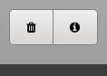

# Mike's Drum Machine

Mike's Drum Machine is an app for creating drum beats online

 

## Description

The app can be used to create drum beats using a variety a samples and a grid layout to select the pattern. It is modelled on drum machines of the past and includes some presets to get you going.

 

## Technologies

- HTML
- CSS
- JavaScript

 

# Usage

 

## Presets

To quickly get started choose a **preset** from the menu

This will load a beat into the grid and automatically adjust the tempo/swing parameters to suit the selected style

 

## Playback

Begin playback using the **transport controls**

You can **start/stop** and toggle **loop mode**. Use the 'Swing' menu to change the **swing value**.

 

## Information Window

The information window shows important parameters

The beat counter displays which beat you are on. You can select the number of divisions in the grid (16/32) and change the tempo with the slider.

 

## Grid Controls

The main grid allows you to control the volume of the individual track and begin customising your own beats

The mute & solo controls will allow you to focus on specific tracks and hush the ones you don't want to hear.

Use the All option to toggle the whole grid for that track.

 

## Clear & Info

You can clear the whole grid with the **clear** button

Check out more info and future features with the **info** button

 

# Future Features

This is my first large-scale (for me!) project using JavaScript and a way for me to put into practice what I have been learning over the last few months. It was a project designed to reinforce my knowledge and push me to discover solutions to make features work. I work in music so I had clear vision of what I wanted the app to do and how it should do it. I made real efforts to follow the DRY principle and reformat code as I went along - this really helped me to discover ways to make my code efficient and avoid repitions.

I was careful to ensure the app is easily expandable in the future. It is possible to add more instruments, samples & presets without editing very much current code.

This was also a valuable lesson in CSS for me. Up to this project CSS had been an afterthought on my projects and I had mostly fumbled my way through it, with a trial-and-error approach. I tried to follow best practices with my CSS also to the best of my knowledge.

In the future I intend to continue adding more featurtes to this app including:

- Extra drum kits samples
- Include more instruments
- Include more presets
- Add an option to save your own beats (using local storage)
